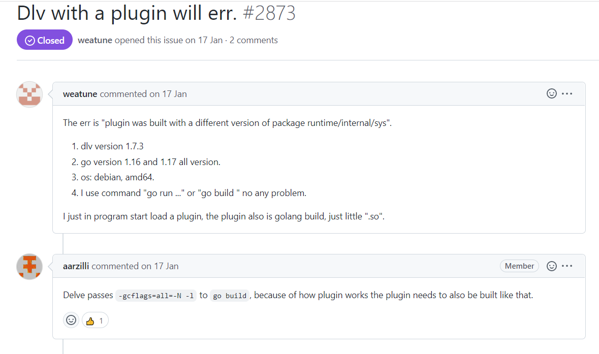

# Environment setup

> 由于lab1中采用了plugin编译模式，而go仅支持在Linux，FreeBSD和macOS实现该模式，故选择WSL + vscode的开发环境

## Install go on wsl

+ 进入官网下载相应包，此处选择go1.6

+ 解压包到/usr/local目录

``` bash
tar -C /usr/local -xzf /mnt/d/Downloads/go1.16.6.linux-amd64.tar.gz
```

+ 配置环境变量

新建一个文件~/.bash_profile

``` bash
export GOPATH=/home/zhy/go
export GOROOT=/usr/local/go
export PATH=$PATH:$GOPATH/bin:$GOROOT/bin
```

修改~/.bashrc

``` bash
source ~/.bash_profile
```

+ 检查安装是否成功

``` bash
go version

go version go1.16 linux/amd64
```

## Install go extension on vscode

+ 使用快捷键Ctrl + Shift + P，输入Go:install go extension

+ 若下载失败，执行以下命令

``` bash
# 新版改成如下链接
go env -w GO111MODULE=on
go env -w GOPROXY=https://proxy.golang.com.cn,direct
```
  
+ 请在终端手动执行命令

``` bash
go get -u -v github.com/go-delve/delve/cmd/dlv@1.7.3
```  

+ 检查安装是否成功

``` bash
dlv version
Delve Debugger
Version: 1.7.3
```

## Debug go file on vscode

+ plugin调试



+ 配置文件

``` json
{
    // 使用 IntelliSense 了解相关属性。 
    // 悬停以查看现有属性的描述。
    // 欲了解更多信息，请访问: https://go.microsoft.com/fwlink/?linkid=830387
    "version": "0.2.0",
    "configurations": [
        {
            "name": "Lab1 worker",
            "type": "go",
            "request": "launch",
            "mode": "debug",
            "program": "${workspaceFolder}/src/main/mrworker.go",
            "args": [
                "${workspaceFolder}/src/main/jobcount.so"
            ]
        },
        {
            "name": "Lab1 coordinator",
            "type": "go",
            "request": "launch",
            "mode": "debug",
            "program": "${workspaceFolder}/src/main/mrcoordinator.go",
            "args": [
                "${workspaceFolder}/src/main/pg-being_ernest.txt",
                "${workspaceFolder}/src/main/pg-dorian_gray.txt",
                "${workspaceFolder}/src/main/pg-frankenstein.txt",
                "${workspaceFolder}/src/main/pg-grimm.txt",
                "${workspaceFolder}/src/main/pg-huckleberry_finn.txt",
                "${workspaceFolder}/src/main/pg-metamorphosis.txt",
                "${workspaceFolder}/src/main/pg-sherlock_holmes.txt",
                "${workspaceFolder}/src/main/pg-tom_sawyer.txt"
            ]
        }
    ]
}
```

## Reference

+ [csdn:download go on wsl](https://blog.csdn.net/shizheng_Li/article/details/122790444)

+ [csdn:vscode go extension download](https://blog.csdn.net/qq_41065919/article/details/107710144)

+ [stackoverflow:how to load plugin when debugging in vscode](https://stackoverflow.com/questions/70642618/cannot-load-plugin-when-debugging-golang-file-in-vscode)

+ [delve plugin debug issue](https://github.com/go-delve/delve/issues/2873)